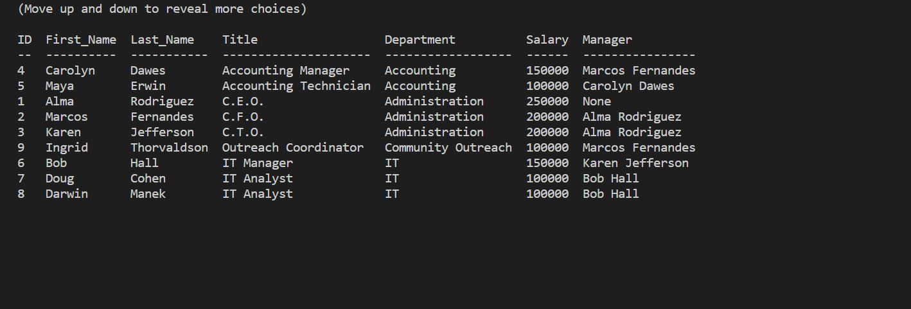

# Employee Tracker

## Description

For this project, I was asked to develop a command-line interface that would allow a manager to manage a company's personnel database. The application uses Node.js with the Inquirer, MySQL2, and console.table packages.

## Instructions

### Installation

To use the application, you will need to clone the repo to your local machine, then run `npm i` to install all of the dependencies. You'll then need to set up the database by running `mysql -u root` followed by `source db/db.sql;` and `source db/schema.sql;`.

### Usage

Once the application is set up, you can initiate it with `node server`. 

[This walkthrough video demonstrates the functionality of the interface.](https://watch.screencastify.com/v/KH8jG145452zlKpOYZLu)

The main menu offers 8 options. You can show a list of existing departments, roles, or employees; add a new department, list, or employee; change the role of an existing employee; or quit the application. If you choose to add or update data, you will be prompted for additional data. Once all of the necessary data has been entered, the application will query the database and log a success or error message in the console. If you have selected to show data, then a table will be displayed in the console. Once the feedback has been displayed, you can click the up or down arrow to bring up the main menu and select another action or quit the application.

## Contact

Brett Piper

[GitHub](https://github.com/bpiper91) | [Email](mailto:bpiper91@gmail.com)